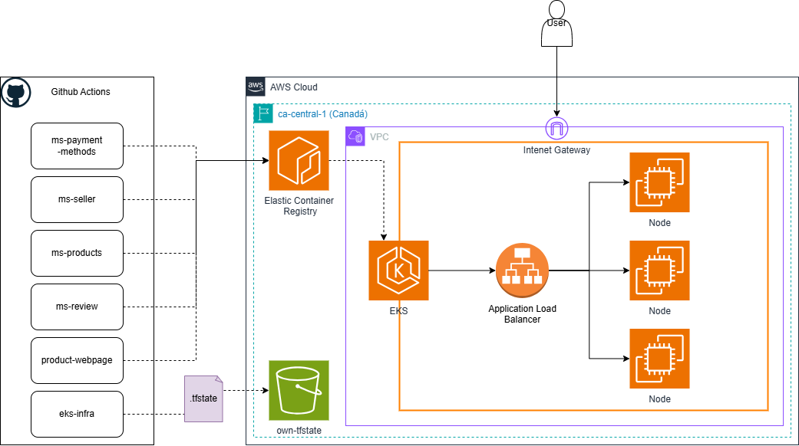

# 📘 Documentação – MercadoLibre Clone (Item Detail Page)

Este repositório contém toda a documentação técnica, arquitetural e organizacional do projeto **MercadoLibre Clone – Item Detail Page**, incluindo:

- Decisões técnicas
- APIs e contratos
- Instruções de execução
- Plano de testes
- Stack de tecnologias utilizadas

---

## Overview

O desafio técnico do Mercado Livre consistiu no desenvolvimento de uma aplicação clone da página de produtos do Meli. A solução deveria trazer consigo uma página de detalhe de produto, integrando dados de produtos, pagamentos, vendedores e reviews.

## 📂 Repositórios do projeto

| Repositório | Descrição |
|-------------|-----------|
| [`frontend-mercadolibre-clone`](https://github.com/MercadoLibre-case/product-web) | Interface Web do projeto, desenvolvida com Next.js, responsável por consumir os microserviços e renderizar a página de detalhe do produto |
| [`ms-product-detail`](https://github.com/MercadoLibre-case/ms-product-detail) | Microserviço responsável pelos dados do produto: título, descrição, imagens, preço, estoque e referência ao vendedor |
| [`ms-seller`](https://github.com/MercadoLibre-case/ms-seller) | Microserviço responsável por informações do vendedor, como nome da loja, reputação e total de vendas |
| [`ms-review`](https://github.com/MercadoLibre-case/ms-review) | Microserviço responsável por avaliações e notas dos produtos (ex: estrelas, número de reviews) |
| [`ms-payment-methods`](https://github.com/MercadoLibre-case/ms-payment-methods) | Microserviço responsável por fornecer os métodos de pagamento disponíveis para cada vendedor |
| [`doc-mercadolibre-clone`](https://github.com/MercadoLibre-case/doc-mercadolibre-clone) | Repositório de documentação técnica e arquitetural do projeto |

---

## 📌 Objetivo do projeto

Construir uma **página de detalhe de produto** inspirada no MercadoLibre, separando o frontend e os serviços backend em microserviços independentes, com comunicação via REST API.

---

## 📐 Sobre a Arquitetura da Solução

O projeto foi estruturado seguindo uma abordagem de microserviços, com cada serviço representando um domínio específico da aplicação. A arquitetura foi composta por um canal (frontend), em Next.js, consumindo os microserviços via API. Orientado por domínios funcionais, o backend foi divido em quatro microserviços (Product, Payment, Seller e Review) desenvolvidos em Python (FastAPI). Para a orquestração foi utilizado um serviço gerenciado de Kubernetes em uma cloud pública (EKS AWS), tendo como Ingress um AWS Application Load Balancer. Também fora utilizado o GitHub Actions para automação do build, push das imagens para o ECR e deploy no cluster EKS. Abaixo uma demonstração de alto nível da arquitetura:

Todos os microserviços são expostos internamente no cluster através de serviços do tipo ClusterIP, garantindo segurança e isolamento interno. O frontend é exposto externamente por meio do Ingress com ALB, utilizando roteamento por path. O tráfego é balanceado entre múltiplos pods através dos deployments do Kubernetes. Deployments foram configurados para suportar rollout controlado, alta disponibilidade e auto-recuperação. 
O frontend consome os microserviços utilizando variáveis de ambiente configuradas para os endpoints internos (`http://ms-product-service:8000`, `http://ms-payment-service:8070`, etc.). O DNS interno do Kubernetes resolve automaticamente os nomes dos serviços dentro do cluster. A exposição externa é feita exclusivamente pelo Ingress, eliminando a necessidade de utilizar múltiplos Load Balancers.

---

## 📐 Sobre a Arquitetura do Software

Na construção dos microsserviços, decidi utilizar o Clean Architecture, garantindo um código mais desacoplado, testável e de fácil manutenção. Dessa forma o código permite que as regras de negócio permaneçam independentes de frameworks, bancos de dados, APIs e qualquer tecnologia externa, facilitando mudanças ou evoluções na aplicação. Esse estilo arquitetural ajuda para a escalabilidade do sistema, garantindo resiliência e se tornando aderente às melhores práticas de desenvolvimento de software.

---

## Sobre os Desafios Enfrentados

O maior desafio foi retomar uma mentalidade mais voltada ao desenvolvimento, não apenas à arquitetura. Converter princípios como SOLID para a prática, garantir um bom nível de manutenibilidade, desenvolver testes de forma consistente e manter o foco no domínio funcional, evitando dependências de frameworks, linguagens, etc. O maior desafio foi, também, o frontend. Garantir responsividade, manutenibilidade, consistencia e tratamento de erros.

---

## Uso de AI

Aqui a IA foi uma grande aliada em troubleshootings, e, principalmente, testes unitários e Integrados.

---

## Execução

Para a execução ocorrer, basta acessar o link [`Do sistema aqui.`]( http://k8s-default-ingressm-c4afdb6714-237803342.ca-central-1.elb.amazonaws.com/items/1).
A URL possui um parametro de ID de produto, por isso a sintaxe é esta :  http://ALB_DNS/items/{id_produto}
Atualmente possuimos apenas 3 produtos, então pode navegar entre:
- http://ALB_DNS/items/1
- http://ALB_DNS/items/2
- http://ALB_DNS/items/3
